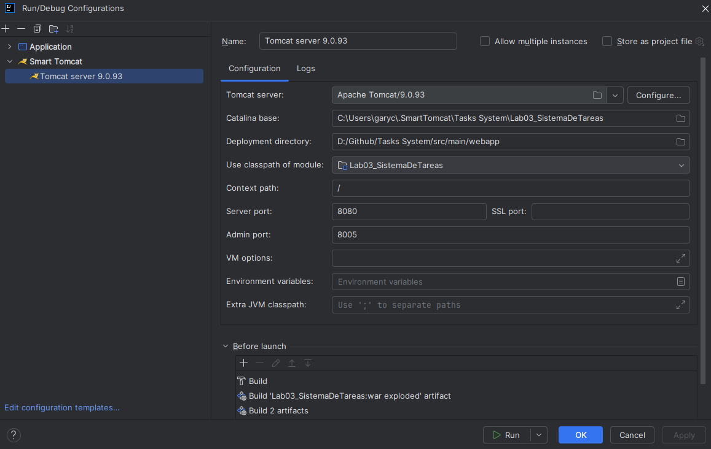
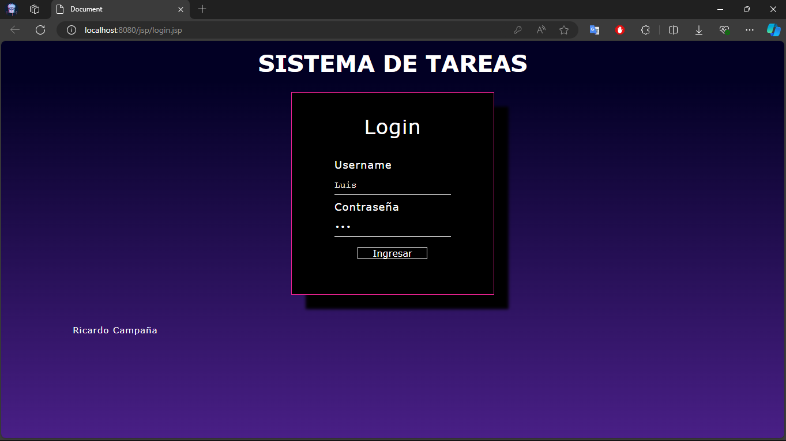
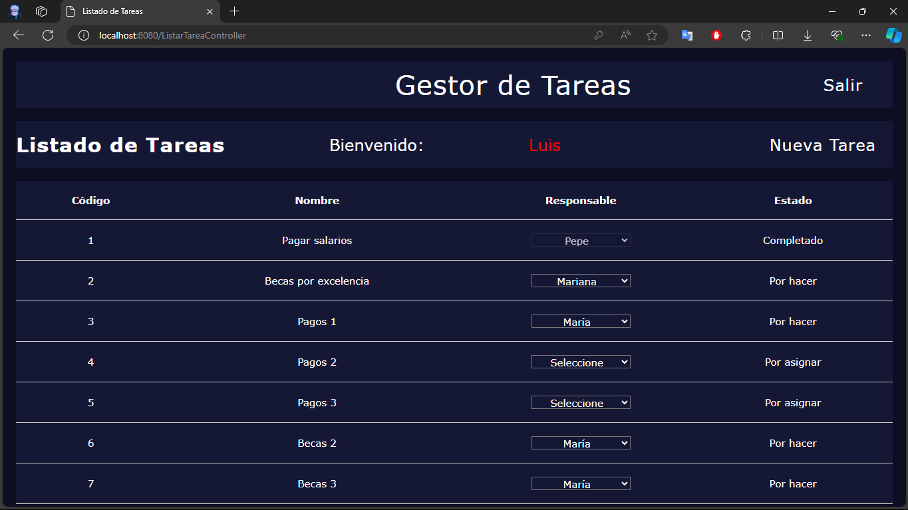
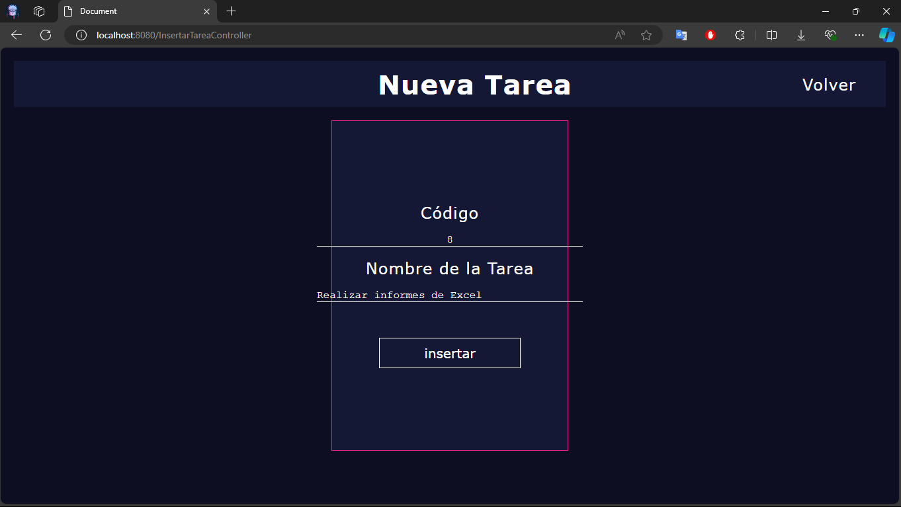
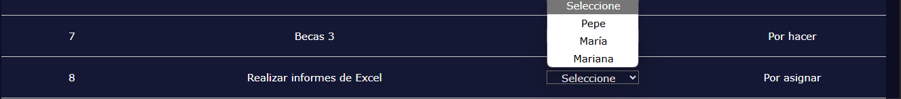
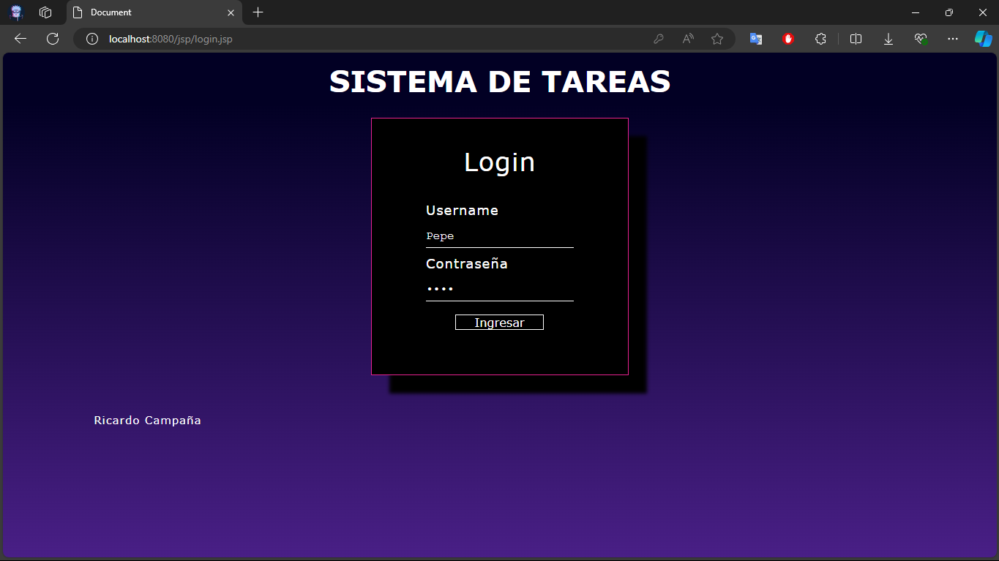
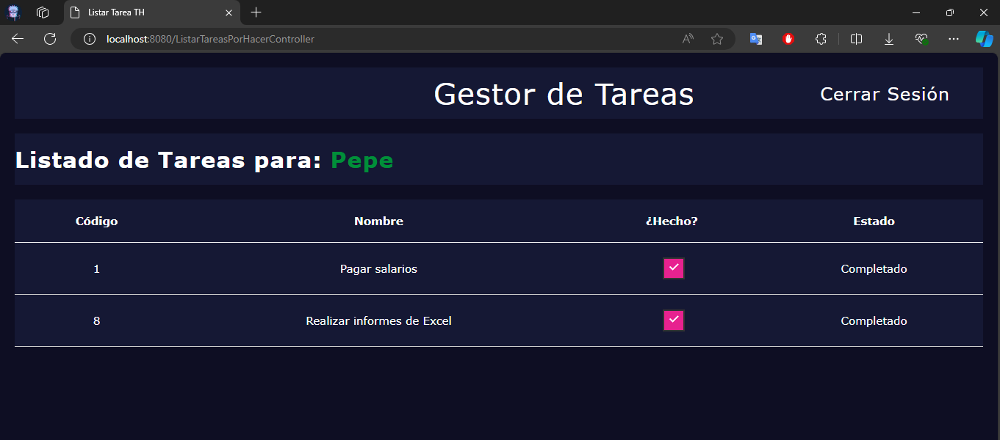
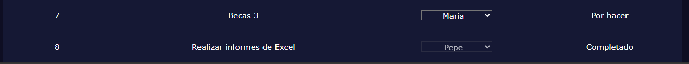

# Sistema de Tareas

Este proyecto es una aplicación web construida en **Java** que permite gestionar tareas asignadas a diferentes usuarios. La aplicación está desarrollada utilizando tecnologías como **Java Servlets** y **JSP** (JavaServer Pages), lo que facilita la interacción entre el backend y las vistas. El proyecto utiliza **Apache Tomcat 9.x** como servidor de aplicaciones, **Maven** para la gestión de dependencias, y **XAMPP** como servidor local para la base de datos **MySQL**.

## Arquitectura básica del programa


## Requisitos Previos

Antes de comenzar, asegúrate de tener lo siguiente instalado y configurado en tu sistema:

- **Java 22**
- **Apache Maven 3.9.x**
- **Apache Tomcat 9.x**
- **XAMPP** (con el servidor de MySQL activado)
- Un IDE como **IntelliJ IDEA** (o cualquier otro de tu preferencia)
- Navegador web

## Configuración de la Base de Datos

El proyecto utiliza una base de datos MySQL llamada `gestorpersonasstmvc`. Puedes configurar la base de datos utilizando **XAMPP** para MySQL y ejecutar los siguientes scripts SQL en **phpMyAdmin** o cualquier otra herramienta de gestión de bases de datos compatible.

### Crear Base de Datos y Tablas

Aquí tienes un ejemplo del script:

```sql
-- Crear base de datos
CREATE DATABASE IF NOT EXISTS gestorpersonasstmvc;
USE gestorpersonasstmvc;

-- Tabla de personas
CREATE TABLE IF NOT EXISTS persona (
    id INT AUTO_INCREMENT PRIMARY KEY,
    nombre VARCHAR(255) NOT NULL,
    password VARCHAR(255) NOT NULL,
    esadmin BOOLEAN NOT NULL DEFAULT 0
);

-- Tabla de tareas
CREATE TABLE IF NOT EXISTS tarea (
    id INT AUTO_INCREMENT PRIMARY KEY,
    nombre VARCHAR(255) NOT NULL,
    idresponsable INT NOT NULL,
    estado INT NOT NULL,
    FOREIGN KEY (idresponsable) REFERENCES persona(id) ON DELETE CASCADE
);

-- Datos de ejemplo para la tabla persona
INSERT INTO persona (nombre, password, esadmin) VALUES
('Luis', 'Luis123', true),
('Pepe', 'Pepe123', false),
('Maria', 'Maria123', false),
('Mariana', 'Mariana123', false);

-- Datos de ejemplo para la tabla tarea
INSERT INTO tarea (nombre, idresponsable, estado) VALUES
('Pagar salarios', 1, 1),
('Becas por excelencia', 3, 1),
('Pagos 1', 1, 1),
('Pagos 2', 1, 1),
('Pagos 3', 1, 1),
('Becas 2', 3, 1),
('Becas 3', 3, 1);

-- Consultas de ejemplo
SELECT * FROM persona;
SELECT * FROM tarea;
```
## Configuración del Servidor Tomcat

Aquí tienes una imagen de la configuración de Tomcat que debes seguir:



## Capturas de pantalla de la aplicación

Iniciamos sesión como administrador (La captura de pantalla es un ejemplo de adminsitrador)



### Login as Admin

Aqui podemos seleccionar la tarea y el responsable que va a realizarla, así mismo podemos observar los posibles estados:

- Por asignar
- Por hacer
- Completado
 


Además podemos agregar nuevas tareas para nuevos usuarios (El id se genera automáticamente)


Tarea visualizada en la lista de tareas



### Login as User
Primero nos logeamos como uno de los usuarios



Luego observamos las tareas que tiene asignado el usuario donde este tendrá la opción de dar en check si 
la tarea la completó:



Seguido a esto, el panel del administrador se actualizará y el estado 
se encontrará en completado:


